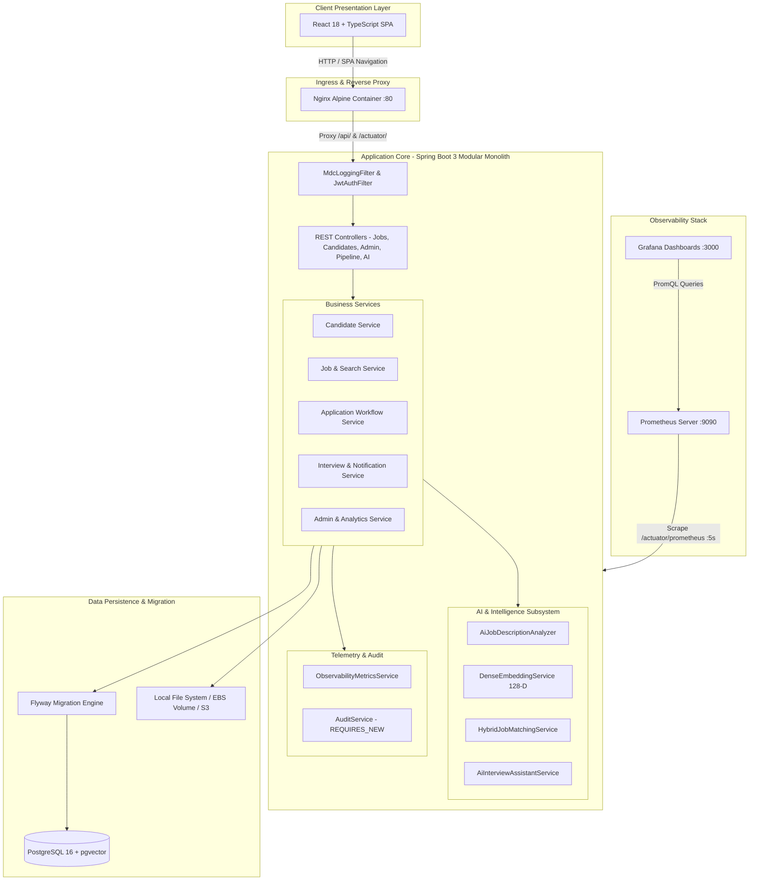
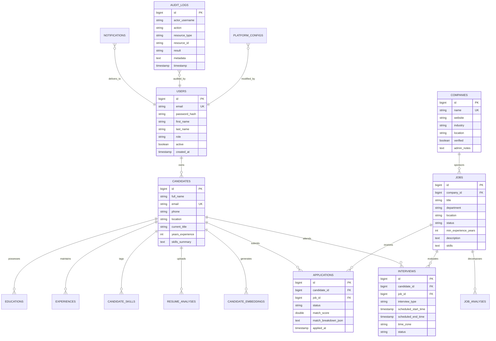
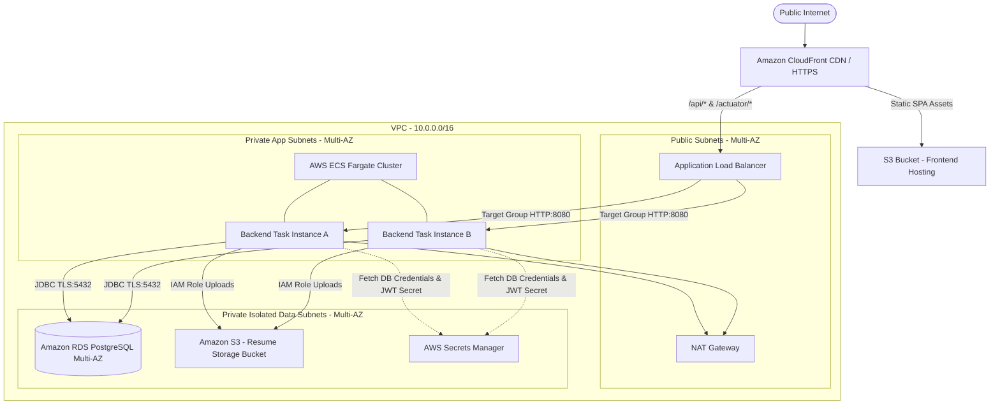

# AI-Powered Recruitment & Job Matching Platform

[](https://spring.io/projects/spring-boot)
[](https://www.oracle.com/java/)
[](https://reactjs.org/)
[](https://www.typescriptlang.org/)
[](https://www.postgresql.org/)
[](https://www.docker.com/)
[](https://prometheus.io/)
[](https://grafana.com/)
[](https://github.com/features/actions)

An enterprise-grade, cloud-native recruitment intelligence platform built with **Java (Spring Boot 3)**, **React 18**, and **Semantic AI / Vector Embeddings**. The platform automates resume ingestion and entity parsing, decomposes job descriptions into structured schema, evaluates candidate-job compatibility through a deterministic hybrid scoring model, coordinates multi-stage recruitment pipelines, schedules timezone-aware interviews, generates role-specific interview preparation guides, provides administrative oversight, and delivers observability through Prometheus and Grafana.

---

## Table of Contents
1. [Key Features](#-key-features)
2. [System Architecture](#-system-architecture)
3. [Entity Relationship Model](#-entity-relationship-model)
4. [Technology Stack](#-technology-stack)
5. [Local Development & Setup Guide](#-local-development--setup-guide)
6. [Docker & Containerized Deployment](#-docker--containerized-deployment)
7. [Cloud Architecture & AWS Deployment Strategy](#-cloud-architecture--aws-deployment-strategy)
8. [Observability & Monitoring](#-observability--monitoring)
9. [Security Architecture](#-security-architecture)
10. [Automated Testing Suite](#-automated-testing-suite)
11. [CI/CD Pipelines](#-cicd-pipelines)
12. [Known Limitations & Technical Roadmap](#-known-limitations--technical-roadmap)

---

## 🌟 Key Features

### 1. Hybrid AI Matching & Recommendation Engine
* **Evidence-Based Multi-Signal Compatibility**: Combines Hard Skills (35%), Semantic Vector Similarity (25%), Seniority/Experience (15%), Relevant Technologies (10%), Preferred Skills (10%), and Education Alignment (5%).
* **Explainable Matching Outputs**: Generates transparent score breakdowns, evidence notes, and compatibility bands (`EXCELLENT_MATCH`, `STRONG_MATCH`, `MODERATE_MATCH`, `WEAK_MATCH`).
* **Dense Embedding Generation**: Produces normalized 128-dimensional dense vector embeddings with semantic domain anchors, non-linear activation (`tanh`), and Cauchy-Schwarz compliant cosine similarity.
* **Skill-Gap Analysis**: Detects missing requirements and provides targeted learning roadmaps.

### 2. Candidate & Resume Ingestion Engine
* **Document Parsing**: Ingests **PDF** (Apache PDFBox) and **DOCX** (Apache POI) formats with magic byte inspection (`%PDF`, `PK\x03\x04`), 10MB file bounds, and SHA-256 file hashing.
* **Structured Profile Management**: Tracks career experience, accredited education, categorized candidate skills, and biographical summaries.

### 3. Recruitment Pipeline & Interview Management
* **Deterministic Stage Progression**: Enforces valid status transitions: `APPLIED` $\rightarrow$ `UNDER_REVIEW` $\rightarrow$ `SHORTLISTED` $\rightarrow$ `INTERVIEW` $\rightarrow$ `HIRED` / `REJECTED`.
* **Timezone-Aware Interview Scheduling**: Manages interview slots, URL/location endpoints, conflict checking, and timezone conversion using `java.time.ZonedDateTime`.
* **AI Interview Preparation Assistant**: Decomposes requisitions and applicant profiles into structured interview guides containing core preparation topics, technical questions, role-specific architecture questions, behavioral HR inquiries, and follow-up probes.
* **Multichannel Notifications**: Decoupled dispatch architecture supporting `EMAIL`, `IN_APP`, and `SMS` delivery channels with delivery failure auditing.

### 4. Administrative Governance & Analytics Hub
* **User & Employer Moderation**: Administrative role elevation, account suspension toggles, self-lockout prevention, company profile verification, and job moderation.
* **Database Aggregation Analytics**: High-performance SQL/JPQL `GROUP BY` aggregations computing active jobs, role distributions, pipeline stages, interview statuses, and AI workloads without memory overhead.
* **Autonomous Security Audit Trail**: Non-blocking `REQUIRES_NEW` transaction logging capturing actor, action, resource, timestamp, and result, with regex-based credential scrubbing (`[REDACTED]`).
* **Dynamic Platform Configurations**: Runtime key-value tuning for auto-shortlisting thresholds, upload boundaries, and maintenance windows.

---

## 🏗️ System Architecture



---

## 🗄️ Entity Relationship Model



---

## 💻 Technology Stack

| Layer | Technologies |
| :--- | :--- |
| **Backend Framework** | Java 17, Spring Boot 3.2.3 (Web, Security, Data JPA, Validation, Actuator) |
| **Database & ORM** | PostgreSQL 16 (pgvector), Hibernate 6.4, Flyway Migration 9.x |
| **Document Processing** | Apache PDFBox 3.0.1, Apache POI 5.2.5 |
| **Security & Auth** | Spring Security 6, JJWT 0.12.5 (HS256), BCrypt (work factor 12) |
| **Frontend Framework** | React 18, TypeScript 5.4, Vite 5.1, TailwindCSS 3.4 |
| **State & Query** | Zustand 4.5, TanStack React Query 5.28, Axios 1.6 |
| **Observability** | Micrometer, Prometheus 2.50, Grafana 10.3, Logback, SLF4J MDC |
| **Testing** | JUnit 5, Mockito, MockMvc, AssertJ, Vitest 1.6, Testing Library |
| **Containerization** | Docker (multi-stage Alpine builds), Docker Compose v2 |
| **CI/CD Automation** | GitHub Actions |

---

## 🚀 Local Development & Setup Guide

### Prerequisites
* **Java**: JDK 17 (Eclipse Temurin recommended)
* **Maven**: 3.9+
* **Node.js**: 20+ and npm
* **Docker & Docker Compose**: v2+

### 1. Clone Repository
```bash
git clone https://github.com/Mallukodanda/AI-Powered-Recruitment-Job-Matching-Platform.git
cd AI-Powered-Recruitment-Job-Matching-Platform
```

### 2. Run Backend Locally (H2 In-Memory Mode)
```bash
cd backend
mvn clean spring-boot:run
```
* Backend starts at `http://localhost:8080`.
* Swagger API Documentation: `http://localhost:8080/swagger-ui.html`.
* H2 Database Console: `http://localhost:8080/h2-console` (`JDBC URL: jdbc:h2:mem:recruitmentdb`, User: `sa`, Password: empty).

### 3. Run Frontend Locally
```bash
cd ../frontend
npm install
npm run dev
```
* Frontend starts at `http://localhost:5173`.

---

## 🐳 Docker & Containerized Deployment

Run the complete production cluster locally with a single command:

```bash
docker compose up --build -d
```

### Verified Service Endpoints
| Service | Internal Host / Port | Host Port | Health Check Endpoint | Credentials |
| :--- | :--- | :--- | :--- | :--- |
| **Frontend SPA** | `frontend:80` | `http://localhost:80` | `http://localhost:80/healthz` | N/A |
| **Backend API** | `backend:8080` | `http://localhost:8080` | `http://localhost:8080/actuator/health` | N/A |
| **PostgreSQL** | `postgres:5432` | `localhost:5432` | `pg_isready -U postgres` | `postgres` / `password` |
| **Prometheus** | `prometheus:9090` | `http://localhost:9090` | `http://localhost:9090/-/healthy` | N/A |
| **Grafana** | `grafana:3000` | `http://localhost:3000` | `http://localhost:3000/api/health` | `admin` / `admin` |

To tear down the cluster and wipe volumes:
```bash
docker compose down -v
```

---

## ☁️ Cloud Architecture & AWS Deployment Strategy



### AWS Service Selection & Cost Analysis
| Tier | Recommended AWS Service | Rationale | Cost Consideration | Alternative Evaluated |
| :--- | :--- | :--- | :--- | :--- |
| **Frontend** | Amazon S3 + CloudFront | Serverless static asset hosting, global edge CDN, low-latency SSL termination | ~$1–3 / month | EC2 Nginx (Higher maintenance & cost) |
| **Backend** | AWS ECS Fargate | Serverless container runtime, automatic zero-downtime rolling deploys, no EC2 patching | ~$25–40 / month (0.5 vCPU, 1GB RAM) | AWS EKS (Over-engineered for monolith) |
| **Database** | Amazon RDS PostgreSQL (db.t4g.micro) | Managed automated backups, multi-AZ failover, point-in-time recovery, encryption at rest | ~$15–20 / month | Self-hosted EC2 Postgres (High operational risk) |
| **Storage** | Amazon S3 (Standard + Glacier) | Scalable object storage for resumes with bucket encryption and signed URLs | < $1 / month | Elastic File System (More expensive) |
| **Secrets** | AWS Secrets Manager | Auto-rotation, KMS encryption, zero plaintext credentials in Git or environments | ~$0.40 / secret / month | Plain environment variables (Security risk) |

---

## 📈 Observability & Monitoring

The platform provides end-to-end telemetry across application, database, and AI workloads:

### 1. Prometheus Metrics Scraped
* **HTTP Latency**: `histogram_quantile(0.95, sum(rate(http_server_requests_seconds_bucket[1m])) by (le, uri))`
* **Error Rate**: `sum(rate(http_server_requests_seconds_count{status=~"5.."}[1m]))`
* **AI Processing Latency**: `recruitment_ai_latency_seconds_max`
* **AI Failures**: `sum(recruitment_ai_failures_total) by (operation, reason)`
* **Connection Pool**: `hikaricp_connections_active`, `hikaricp_connections_idle`, `hikaricp_connections_pending`
* **JVM Heap**: `jvm_memory_used_bytes{area="heap"}`

### 2. Grafana Dashboard
* Auto-provisioned in Docker Compose at `http://localhost:3000`.
* Panels pre-configured for throughput, p95 latency, 5xx error spikes, AI operational health, JVM heap memory, and HikariCP connection health.

### 3. Structured Logging
* Configured in `logback-spring.xml` with MDC request tracing.
* Every HTTP request receives an `X-Request-ID` and is tagged in logs:
  ```text
  2026-09-28 23:30:06.966 INFO  [main] c.r.p.s.a.AiInterviewAssistantService [user=admin@example.com traceId=a1b2c3d4] : Generating AI interview preparation guide for job ID 3
  ```

---

## 🔒 Security Architecture

1. **Defense-in-Depth Authentication**: Stateless JWT Bearer authentication with 24-hour expiration, cryptographic signature validation, and BCrypt password hashing.
2. **Administrative Self-Protection Guardrails**: Explicit business logic preventing administrative users from demoting, disabling, or deleting their own active profile.
3. **Sensitive Data Redaction in Audit Logging**: Regex-based token sanitization in `AuditService` preventing passwords, API keys, and bearer tokens from entering audit tables or forensic logs.
4. **File Ingestion Security**:
   - MIME type and magic byte verification.
   - Strict 10MB payload size limits.
   - Path traversal prevention (`..`, `/`, `\`) with UUID-based storage keys.
5. **CORS & CSRF Hardening**: Configurable allowed origins, stateless session configuration, and secure credential handling.

---

## 🧪 Automated Testing Suite

To execute the test suites:

### Backend Tests (86 Tests)
```bash
cd backend
mvn clean test
```
* **Coverage**: Domain models, repositories, Spring Security authorization, workflow state machines, AI structured output parsing, vector mathematics, and integration scenarios.

### Frontend Tests (8 Tests)
```bash
cd frontend
npm test
```
* **Coverage**: UI component unit tests, Candidate lifecycle simulation, Recruiter lifecycle simulation.

---

## 🔁 CI/CD Pipelines

Implemented with **GitHub Actions**:
1. **Pull Request Workflow (`.github/workflows/pull-request.yml`)**:
   - Triggers on PRs to `main`.
   - Executes backend tests (`mvn verify`).
   - Executes frontend build & Vitest test suite (`npm run build && npm test`).
   - Validates `docker-compose.yml` syntax.
2. **Main Branch Workflow (`.github/workflows/main.yml`)**:
   - Triggers on merges to `main`.
   - Runs full regression test suite.
   - Builds and tags multi-stage Docker container images with Git SHA.
   - Archives release bundle artifacts.

---

## 📋 Known Limitations & Technical Roadmap

* **Distributed Rate Limiting**: The platform enforces single-node memory-based limits; multi-instance clustering requires an external Redis token-bucket implementation *(Planned)*.
* **Asynchronous OCR Worker Queue**: Multi-page PDF text extraction is handled within worker threads; decoupling via RabbitMQ or AWS SQS is recommended for high-volume enterprise ingestion *(Planned)*.
* **Vector Index Scaling**: The current 128-dimensional dense vector embeddings run in-memory and via PostgreSQL pgvector; scaling to 10M+ documents warrants an OpenSearch or Milvus index cluster *(Planned)*.

---

## 📜 License
This project is licensed under the MIT License.
